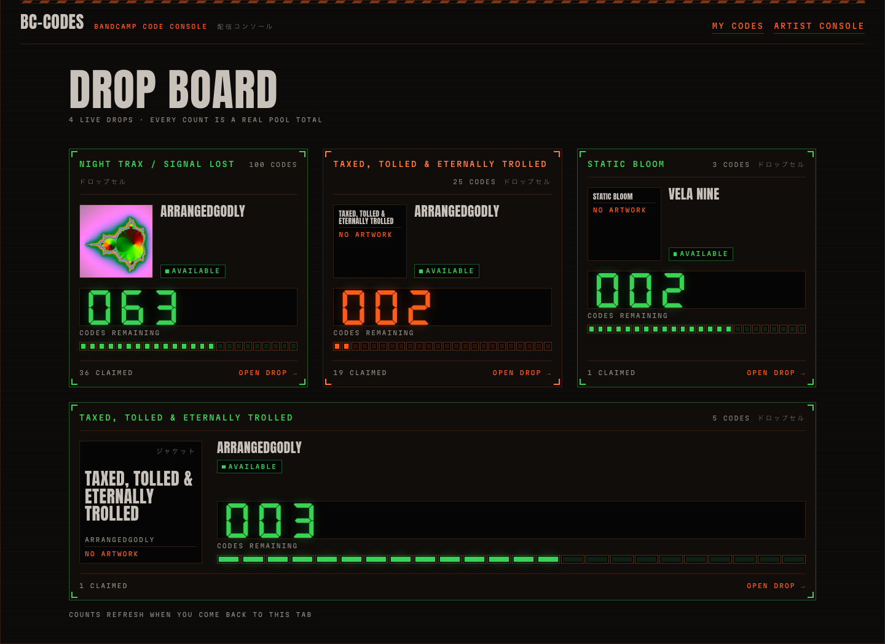
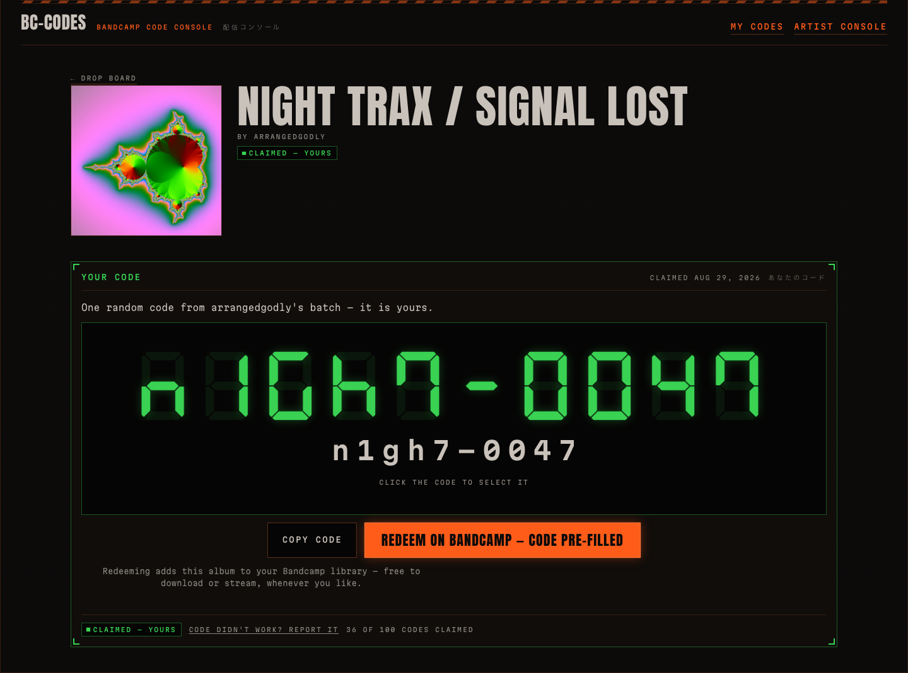
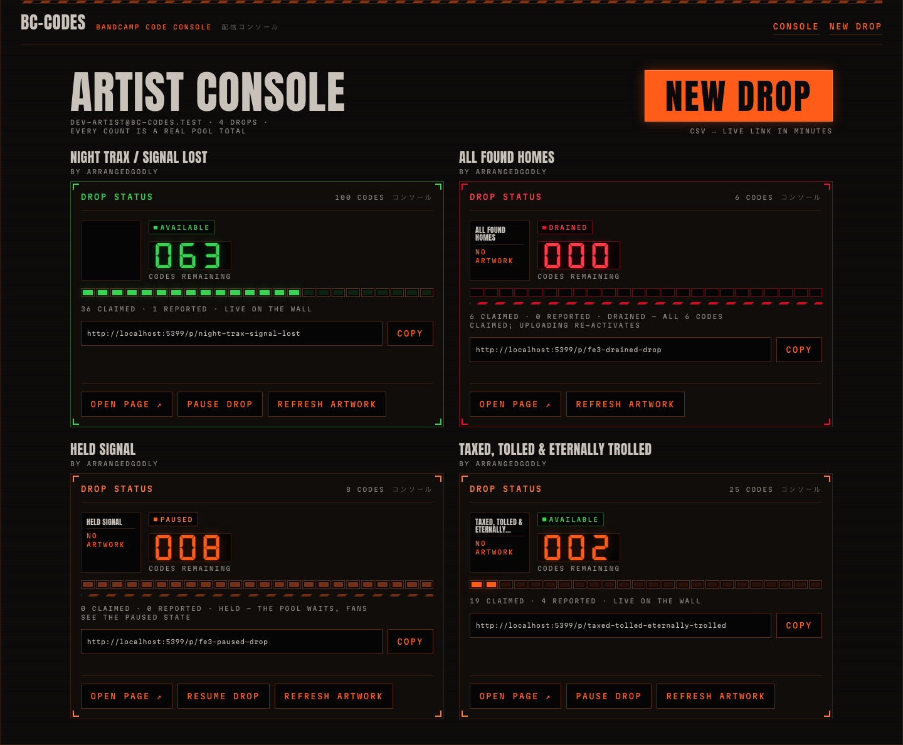

# bc-codes

**One random Bandcamp download code per verified fan — atomically, fairly, no accounts.**

Artists paste a Bandcamp giveaway CSV, get one shareable link, and stop hand-pasting codes
into DMs and comment threads. Fans tap the link, verify an email once, and walk away with a
working code and a one-click path to Bandcamp's redemption page.

**Live:** <https://codes.arrangedgodly.com>



The interface is drawn as a command console in a state of calm emergency — every number on
screen is a real pool count, every meter renders a true fraction, and a drained pool says
drained. The design system and its rules are documented in [`DESIGN.md`](DESIGN.md).

## Why it exists

Pasting raw codes into comments means one greedy fan with a fast refresh can drain the whole
batch in seconds, and honest fans leave empty-handed. bc-codes makes fairness the product:

- **No code is ever dispensed twice**, including under concurrent claim bursts.
- **One code per verified fan per project** — plus exactly one reissue if a code turns out dead.
- **Paused and drained pools dispense nothing** — and say so honestly.

These are not aspirations; they are executable test invariants
([`tests/invariants.test.ts`](tests/invariants.test.ts)), verified against seeded
250-concurrent-claim bursts on real D1.

## The two sides

| Fans | Artists |
| --- | --- |
| Board of live drops with real availability | Email-OTP sign-in, no passwords |
| One code per verified email, re-shown on revisit | CSV → shareable link in about three minutes |
| Copy button + deep link straight to Bandcamp `/yum` | Lenient CSV parser with dedupe + count feedback |
| "My codes" page, works from any device | Draft / active / paused states, live stats, pause and resume |
| Dead-code report → one replacement | Cover art auto-fetched from the album page, cached in R2 |




## Under the hood

- **SvelteKit 2 + TypeScript** on **Cloudflare Workers** (Static Assets), with **D1** as the
  single source of dispense truth and **R2** as the artwork cache.
- **Resend** for OTP mail, behind a mailer port with a prepared Brevo fallback — provider
  specifics never leave one file.
- **Fan privacy by construction**: fan emails are stored hash-only (HMAC + server-side
  pepper). There is no readable fan PII at rest.
- **Accessibility as a floor, not a feature**: WCAG-AA contrast computed against the exact
  token palette, keyboard-complete flows, `prefers-reduced-motion` fully honored, decorative
  layers `aria-hidden` with the accessible truth alongside.
- **Security posture**: two-tier CSP (nonce-based for pages, static for API), HSTS,
  `X-Frame-Options: DENY`, no third-party scripts, secrets only via Workers secrets.

## Develop locally

Requires Node ≥ 24 and a Wrangler login for the local platform proxy.

```sh
npm install
cp .dev.vars.example .dev.vars
npm run db:migrate:local
npm run db:seed
npm run dev
```

Fill `.dev.vars` with `openssl rand -hex 32` values first (the file lists what it needs).
The seed lands a dogfooding project with demo codes so the board has something to show.

Useful scripts: `npm run check` (svelte-check), `npm run build` (adapter-cloudflare output
into `.svelte-kit/cloudflare`), `npm run db:migrate` (remote D1).

## Testing

```sh
npm test
npm run test:e2e
```

- **269 unit/integration tests** — vitest running inside workerd against real D1, including
  the invariant suite with seeded concurrent-burst races.
- **64 end-to-end tests** — Playwright driving every journey (artist CSV → share link, fan
  claim → redeem, my-codes on a new device, report → reissue, drained) at desktop **and**
  mobile viewports, plus axe accessibility scans, keyboard/focus/reduced-motion journeys,
  and CSP/header assertions. Requires a one-time `npx playwright install chromium`.

## Deploying

Deliberately manual — no automation deploys this repo. Two artifacts, in order:

1. [`scripts/provision.sh`](scripts/provision.sh) — an interactive wizard for the
   human-only steps: Cloudflare account + scoped API token, D1 databases, R2 bucket, Resend
   domain + send-only key, DNS records. Writes `.deploy.env` (gitignored).
2. [`docs/ultron/deploy-runbook.md`](docs/ultron/deploy-runbook.md) — the ordered deploy:
   staging first (with smoke checks and a safe production-grade burst re-run), then
   production, custom domain, and email enablement.

## Documentation

- [`PRODUCT.md`](PRODUCT.md) — users, purpose, capabilities, principles
- [`DESIGN.md`](DESIGN.md) — the visual world, tokens, and design rules
- [`docs/ultron/`](docs/ultron/) — plan, research records (stack, email, redemption
  pipelining), and the deploy runbook
