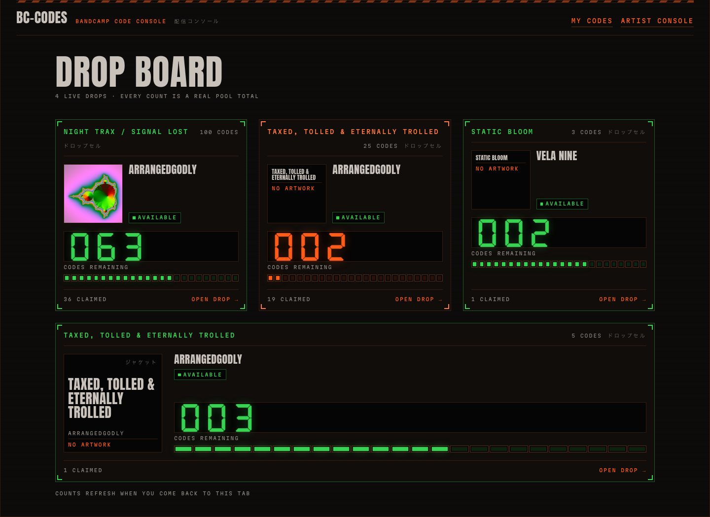
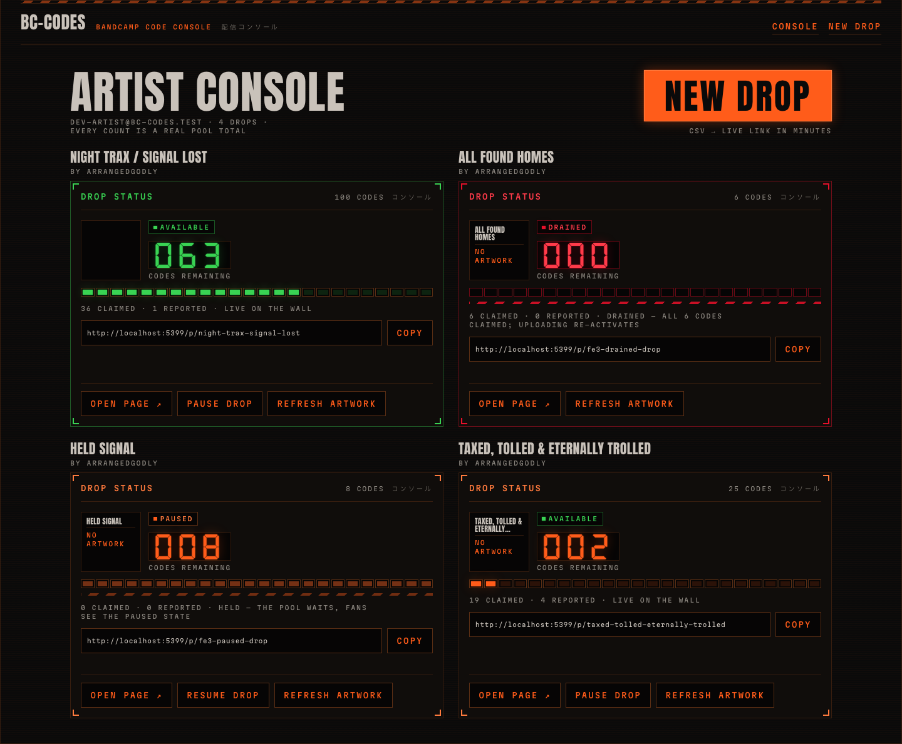

# bc-codes

**Turn a batch of Bandcamp download codes into one shareable drop.**

Artists upload a CSV and share a link. Fans verify their email, claim a code, and open Bandcamp with the code already filled in. The artist console handles inventory, pauses, additional batches, and reported codes without a thread of manual DMs.

[Open the drop board](https://codes.arrangedgodly.com) · [Fan workflow](#claim-a-code) · [Artist controls](#run-a-drop) · [Local setup](#run-locally)



*Existing project capture. Availability is a snapshot, not a promise of current inventory.*

## Two sides of the same pool

| For fans | For artists |
| --- | --- |
| Browse active drops and their available inventory | Create a drop with a title, artist name, and Bandcamp album URL |
| Verify an email with a six-digit code | Sign in with an email code instead of a password |
| Receive one original claim per verified email per project | Upload CSV batches with duplicate and invalid-row feedback |
| Revisit a claim or recover it through **My codes** | Copy a share link, pause or resume, and refresh cover art |
| Copy the download code or open Bandcamp’s redemption page | Review recent claims and the report/replacement ledger |

The interface uses a dark command-console aesthetic: seven-segment counters, inventory meters, and distinct active, paused, and drained states. Its visual rules live in [DESIGN.md](DESIGN.md).

## Claim a code

1. Open a drop from the board or an artist’s shared link.
2. Choose **launch claim**, enter your email, and select **send my code**.
3. Enter the six-digit email code and choose **verify + claim**. An already verified browser can claim directly.
4. Use **copy code**, or open Bandcamp’s redemption page with the download code pre-filled. Complete redemption there.

The verification screen supports sending a fresh code after the cooldown and switching email addresses. If clipboard access fails, the code is selected so you can copy it with Ctrl/Cmd+C.

**Coming back later:** reopening the project shows your existing claim, including after the artist pauses the drop or the pool empties. **My codes** lets you recover claims on another device by verifying the same email.

**A code did not work?** The report flow permits one report per claim and at most one replacement, subject to remaining inventory. Reporting while the pool is empty consumes that allowance; adding codes later does not reopen it.

> **Claimed is not the same as redeemed.** bc-codes records that it dispensed a code. It does not synchronize redemption status with Bandcamp or guarantee that every code uploaded by an artist remains redeemable.

## Run a drop

Sign in to the artist console, select **new drop**, and enter the drop title, artist name, and album URL. The project starts as a draft. Upload a CSV through the file picker or drag-and-drop area; importing new valid codes activates the draft.



*Development capture with a test identity and local share links.*

| Control | What it does |
| --- | --- |
| **Copy** share link / **open page** | Share the project or inspect its fan-facing page |
| **Pause drop** / **resume drop** | Stop or reopen new claims without deleting inventory |
| Upload another CSV | Add new codes; duplicates in the file or existing pool are skipped |
| Edit project details | Update title, artist name, and album URL; established live slugs stay stable |
| **Refresh artwork** | Retry the Bandcamp cover-art lookup |
| Recent claims | Inspect the newest 20 claims |
| Report ledger | See reported codes, timestamps, optional notes, and replacement outcomes |

Artists manage their own code inventory. The console does not expose a fan-email list, and this build does not include a drop-delete control.

### Inventory states

| State | New claims | What changes it |
| --- | --- | --- |
| **Draft** | Unavailable | Import at least one new valid code to activate |
| **Active** | Available while inventory remains | Pause the drop or exhaust the pool |
| **Paused** | Blocked; hidden from the public board | Resume explicitly; uploading codes preserves the pause |
| **Drained** | Unavailable | Import new valid codes to reactivate |

An all-duplicate upload changes neither the count nor state. Existing claims remain accessible after pause or drain. Pausing blocks new claims, but an existing claimant’s report can still receive a replacement when inventory is available.

Board counts are server-rendered and refresh when you return to the tab, with a 60-second throttle. They are not a continuously streamed inventory feed.

### CSV and album requirements

- CSV uploads are limited to **2 MiB**, with a `code` column/header and recognizable `xxxx-xxxx` alphanumeric codes.
- The parser tolerates common Bandcamp-export formatting, including BOMs, quoted cells, mixed line endings, blank lines, and uppercase codes.
- Import feedback separates new codes, duplicates, and invalid line numbers. Suggested album metadata must be explicitly applied.
- Titles and artist names accept 1–200 normalized characters.
- Album URLs must use an artist subdomain of `bandcamp.com`. Custom-domain album URLs are not accepted. HTTP URLs normalize to HTTPS; query strings and fragments are removed.

## Allocation and identity

The server uses D1 transactions/batches and database constraints to coordinate claims rather than trusting browser counters. The invariant tests exercise concurrent allocation, duplicate claims, paused/empty pools, and the report path.

The identity boundary is **a verified email address**, not proof of one unique human. Each verified email can hold one original claim per project, with at most one replacement.

| Data or session | Handling |
| --- | --- |
| Fan email identity in application D1 storage | Normalized and represented by HMAC-SHA256 with a server-side pepper |
| Artist identity | Artist email addresses are stored readably |
| Email delivery | The configured mail provider receives the recipient address to deliver the sign-in code |
| Local console mailer | Logs the recipient and one-time code to the development terminal |
| Claims and reports | Include claim metadata, hashed IP information, and optional report notes |
| Browser sessions | Signed HttpOnly, SameSite=Lax cookies; secure on HTTPS; token hashes stored in D1 |

Email codes expire after ten minutes, with a 60-second resend cooldown and five failed verification attempts. Artist sessions last seven days; fan sessions use a 180-day lifetime with sliding renewal.

## Stack and architecture

| Layer | Technology | Responsibility |
| --- | --- | --- |
| Interface and routes | Svelte 5, SvelteKit 2, TypeScript 6 | Board, claim flow, recovery, and artist console |
| Build and hosting | Vite 8, Cloudflare adapter, Workers Static Assets | Build the app and serve its pages/server endpoints |
| Database | Cloudflare D1, binding `DB` | Projects, code inventory, claims, reports, identities, sessions, and OTP limits |
| Artwork | Cloudflare R2, binding `ART` | Cache album covers and serve them through `/art/[projectId]` |
| Mail | Resend, console driver, optional Brevo driver | Deliver email verification through one provider interface |
| Tests | Vitest/workerd, Playwright, axe | Allocation invariants, browser journeys, and accessibility checks |

Artwork is extracted from the album page’s `og:image`. Unusable artwork falls back to a text card; when R2 is unavailable or a write fails, the implementation can use the cover’s CDN URL. Brevo is a selectable provider alternative, not automatic failover.

## Run locally

Use **Node.js 24 or newer**. The repository enables strict engine checks.

```sh
git clone https://github.com/Arrangedgodly/bc-codes.git
cd bc-codes
npm ci
cp .dev.vars.example .dev.vars
```

On PowerShell, use `Copy-Item .dev.vars.example .dev.vars` for the last step.

Fill the three secret values locally before continuing:

| Variable | Purpose |
| --- | --- |
| `SESSION_SECRET` | Sign session cookies |
| `EMAIL_PEPPER` | Derive protected fan-email identifiers |
| `OTP_PEPPER` | Protect stored verification-code representations |
| `MAILER_DRIVER=console` | Keep development email in the terminal |

Use independently generated random secrets, such as output from `openssl rand -hex 32`. Do not commit the populated file. Keep the explicit console-driver setting: the dev server otherwise inherits the production mailer setting from `wrangler.jsonc`.

```sh
npm run db:migrate:local
npm run db:seed
npm run dev
```

The seed creates a local demonstration project and fabricated codes. It is for exercising the interface, not redeeming music on Bandcamp.

## Commands and verification

| Command | Scope |
| --- | --- |
| `npm run dev` | Start the local development server |
| `npm run check` | Synchronize SvelteKit and run Svelte/TypeScript checks |
| `npm run build` | Produce Cloudflare-adapter output in `.svelte-kit/cloudflare` |
| `npm run preview` | Preview a production build locally |
| `npm test` | Run Vitest unit/integration tests in the worker environment |
| `npm run test:e2e` | Run Playwright browser journeys and accessibility checks |
| `npm run db:migrate:local` | Apply migrations to local D1 |
| `npm run db:seed` | Seed local D1 |
| `npm run db:migrate` | Apply migrations to **remote D1** |

Browser tests require Chromium: run `npx playwright install chromium` once. The suite covers desktop and mobile layouts, keyboard/focus behavior, reduced motion, headers, claims, reports, and artist workflows.

**Use a disposable local test database.** The end-to-end setup removes its `qa2-`/`qa3-` fixtures and clears local pending-OTP/rate-counter rows. Stop a separate development server before starting the harness. These instructions describe the supplied suites; they are not a report of a newly executed test run.

## Self-hosting and deployment

The checked-in `wrangler.jsonc` contains maintainer-specific production and staging database IDs, bucket, domain, and sender settings. Replace these with your own resources before running remote migrations or deployment commands.

Deployment is a manual workflow. Review [wrangler.jsonc](wrangler.jsonc), the [migrations](migrations), and [scripts/provision.sh](scripts/provision.sh), configure your Cloudflare resources and transactional-mail provider, then validate staging before production.

The provisioning script is not a turnkey fork installer: its database-ID replacement only handles the original placeholder IDs. It will not automatically replace the maintainer IDs currently checked into the configuration. Configure secrets through the deployment environment; keep local secret files out of Git.

## Troubleshooting

| Symptom | Check |
| --- | --- |
| `D1_ERROR: no such table: projects` | Apply local migrations, then seed. A changed local database ID can select a fresh database. |
| OTP requests fail in development | Keep `MAILER_DRIVER=console` in `.dev.vars`; read the code from the development terminal. |
| End-to-end setup cannot reach the app | Resolve database/mailer errors and stop stale processes holding the configured test port. |
| Import adds no inventory | Check duplicate/invalid-row feedback and the required code column. |
| Cover art is missing | Check the supported Bandcamp album URL and try **refresh artwork**. A text card is the fallback. |
| A claimed code is not redeemed | Redemption happens on Bandcamp; application inventory only records allocation. |

## Project notes

- [PRODUCT.md](PRODUCT.md): original product direction and principles; some historical planning language remains.
- [DESIGN.md](DESIGN.md): visual system, tokens, and interaction rules.
- [tests/invariants.test.ts](tests/invariants.test.ts): executable allocation invariants.
